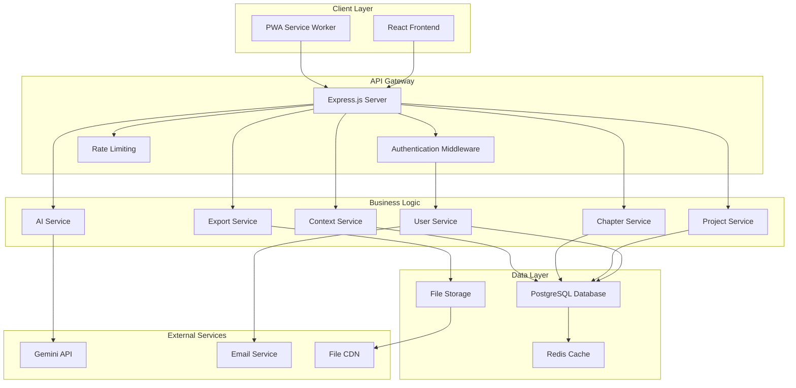

# Design Document

## Overview

QuillHaven is a full-stack web application that provides AI-powered writing assistance for long-form creative content. The platform combines a React-based frontend with a Node.js backend, PostgreSQL database, and Gemini AI integration to deliver context-aware chapter generation and comprehensive project management for writers.

## Architecture

### High-Level Architecture



### Technology Stack

**Frontend:**
- React 18 with TypeScript
- Next.js for SSR and routing
- Tailwind CSS for styling
- React Query for state management
- Monaco Editor for text editing

**Backend:**
- Node.js with Express.js
- TypeScript for type safety
- JWT for authentication
- Prisma ORM for database operations
- Bull Queue for background jobs

**Database:**
- PostgreSQL for primary data storage
- Redis for caching and session management
- AWS S3 for file storage

**AI Integration:**
- Google Gemini API for content generation
- Custom prompt engineering for context injection

## Components and Interfaces

### Frontend Components

#### Authentication Components
- `LoginForm`: Handles user login with validation
- `RegisterForm`: User registration with email verification
- `PasswordReset`: Password recovery functionality
- `AuthGuard`: Route protection for authenticated users

#### Project Management Components
- `ProjectDashboard`: Overview of all user projects
- `ProjectCreator`: Wizard for new project setup
- `ProjectSettings`: Configuration and metadata management
- `ProjectExporter`: Export functionality with format selection

#### Chapter Management Components
- `ChapterList`: Displays all chapters with drag-and-drop ordering
- `ChapterEditor`: Rich text editor with auto-save
- `ChapterGenerator`: AI generation interface with parameters
- `VersionHistory`: Chapter revision tracking and restoration

#### Context Management Components
- `CharacterDatabase`: Character profiles and relationship tracking
- `PlotTracker`: Plot thread management and progression
- `WorldBuilder`: Setting and world-building element management
- `ContextViewer`: Unified view of all project context

### Backend API Endpoints

#### Authentication Endpoints
```typescript
POST /api/auth/register
POST /api/auth/login
POST /api/auth/logout
POST /api/auth/refresh
POST /api/auth/forgot-password
POST /api/auth/reset-password
```

#### Project Management Endpoints
```typescript
GET /api/projects
POST /api/projects
GET /api/projects/:id
PUT /api/projects/:id
DELETE /api/projects/:id
GET /api/projects/:id/export
```

#### Chapter Management Endpoints
```typescript
GET /api/projects/:projectId/chapters
POST /api/projects/:projectId/chapters
GET /api/chapters/:id
PUT /api/chapters/:id
DELETE /api/chapters/:id
POST /api/chapters/:id/generate
GET /api/chapters/:id/versions
```

#### Context Management Endpoints
```typescript
GET /api/projects/:projectId/context
PUT /api/projects/:projectId/context
GET /api/projects/:projectId/characters
POST /api/projects/:projectId/characters
PUT /api/characters/:id
DELETE /api/characters/:id
```

## Data Models

### User Model
```typescript
interface User {
  id: string;
  email: string;
  passwordHash: string;
  firstName?: string;
  lastName?: string;
  writingPreferences: WritingPreferences;
  subscriptionTier: 'free' | 'premium' | 'professional';
  createdAt: Date;
  updatedAt: Date;
}

interface WritingPreferences {
  defaultGenre: string;
  preferredChapterLength: number;
  writingStyle: string;
  aiAssistanceLevel: 'minimal' | 'moderate' | 'extensive';
}
```

### Project Model
```typescript
interface Project {
  id: string;
  userId: string;
  title: string;
  description?: string;
  genre: string;
  targetLength: number;
  currentWordCount: number;
  status: 'draft' | 'in-progress' | 'completed';
  context: ProjectContext;
  chapters: Chapter[];
  createdAt: Date;
  updatedAt: Date;
}

interface ProjectContext {
  characters: Character[];
  plotThreads: PlotThread[];
  worldBuilding: WorldElement[];
  timeline: TimelineEvent[];
}
```

### Chapter Model
```typescript
interface Chapter {
  id: string;
  projectId: string;
  title: string;
  content: string;
  wordCount: number;
  order: number;
  status: 'draft' | 'generated' | 'edited' | 'final';
  generationParams?: GenerationParams;
  versions: ChapterVersion[];
  createdAt: Date;
  updatedAt: Date;
}

interface GenerationParams {
  prompt: string;
  length: number;
  tone: string;
  style: string;
  contextIds: string[];
}
```

### Context Models
```typescript
interface Character {
  id: string;
  projectId: string;
  name: string;
  description: string;
  role: 'protagonist' | 'antagonist' | 'supporting' | 'minor';
  relationships: Relationship[];
  developmentArc: string;
  firstAppearance?: string;
}

interface PlotThread {
  id: string;
  projectId: string;
  title: string;
  description: string;
  status: 'introduced' | 'developing' | 'climax' | 'resolved';
  relatedCharacters: string[];
  chapterReferences: string[];
}

interface WorldElement {
  id: string;
  projectId: string;
  type: 'location' | 'rule' | 'culture' | 'history';
  name: string;
  description: string;
  significance: string;
  relatedElements: string[];
}
```

## AI Integration Design

### Gemini API Integration

The AI service will integrate with Google's Gemini API to provide context-aware content generation:

```typescript
interface AIService {
  generateChapter(params: ChapterGenerationRequest): Promise<ChapterGenerationResponse>;
  analyzeContext(content: string): Promise<ContextAnalysis>;
  checkConsistency(context: ProjectContext, newContent: string): Promise<ConsistencyReport>;
}

interface ChapterGenerationRequest {
  prompt: string;
  projectContext: ProjectContext;
  previousChapters: string[];
  parameters: {
    length: number;
    tone: string;
    style: string;
    focusCharacters: string[];
    plotPoints: string[];
  };
}
```

### Context Injection Strategy

1. **Character Context**: Include character descriptions, relationships, and development arcs
2. **Plot Context**: Reference active plot threads and their current status
3. **World Context**: Include relevant world-building elements and established rules
4. **Narrative Context**: Summarize previous chapters and maintain timeline consistency

### Prompt Engineering

The system will use structured prompts that combine:
- Base writing instructions
- Project-specific context
- Chapter-specific parameters
- Style and tone guidelines
- Consistency requirements

## Error Handling

### Frontend Error Handling
- Global error boundary for React components
- Toast notifications for user-facing errors
- Retry mechanisms for failed API calls
- Offline mode with local storage fallback

### Backend Error Handling
- Centralized error middleware
- Structured error responses with codes
- Logging with correlation IDs
- Graceful degradation for external service failures

### AI Service Error Handling
- Retry logic with exponential backoff
- Fallback to manual writing mode
- Rate limit handling and queuing
- Content filtering and safety checks

## Testing Strategy

### Unit Testing
- Jest for JavaScript/TypeScript testing
- React Testing Library for component testing
- Supertest for API endpoint testing
- 80%+ code coverage requirement

### Integration Testing
- Database integration tests with test containers
- API integration tests with mock external services
- End-to-end user flow testing

### Performance Testing
- Load testing for concurrent users
- Database query optimization
- AI API response time monitoring
- Frontend bundle size optimization

### Security Testing
- Authentication and authorization testing
- Input validation and sanitization
- SQL injection prevention
- XSS protection verification

## Deployment and Infrastructure

### Development Environment
- Docker containers for local development
- Hot reloading for frontend and backend
- Local PostgreSQL and Redis instances
- Mock Gemini API for testing

### Production Environment
- AWS ECS for container orchestration
- RDS PostgreSQL with read replicas
- ElastiCache Redis for caching
- CloudFront CDN for static assets
- Application Load Balancer with SSL termination

### CI/CD Pipeline
- GitHub Actions for automated testing
- Automated deployment to staging environment
- Manual approval for production deployment
- Database migration automation
- Rollback procedures for failed deployments

## Security Considerations

### Data Protection
- AES-256 encryption for sensitive data at rest
- TLS 1.3 for data in transit
- Regular security audits and penetration testing
- GDPR compliance for user data handling

### Authentication Security
- JWT tokens with short expiration times
- Refresh token rotation
- Account lockout after failed attempts
- Two-factor authentication support

### API Security
- Rate limiting per user and IP
- Input validation and sanitization
- CORS configuration for frontend access
- API key management for external services

## Monitoring and Observability

### Application Monitoring
- Error tracking with Sentry
- Performance monitoring with New Relic
- Custom metrics for business logic
- Real-time alerting for critical issues

### Infrastructure Monitoring
- AWS CloudWatch for infrastructure metrics
- Database performance monitoring
- API response time tracking
- User activity analytics

### Logging Strategy
- Structured logging with correlation IDs
- Centralized log aggregation
- Log retention policies
- Security event logging